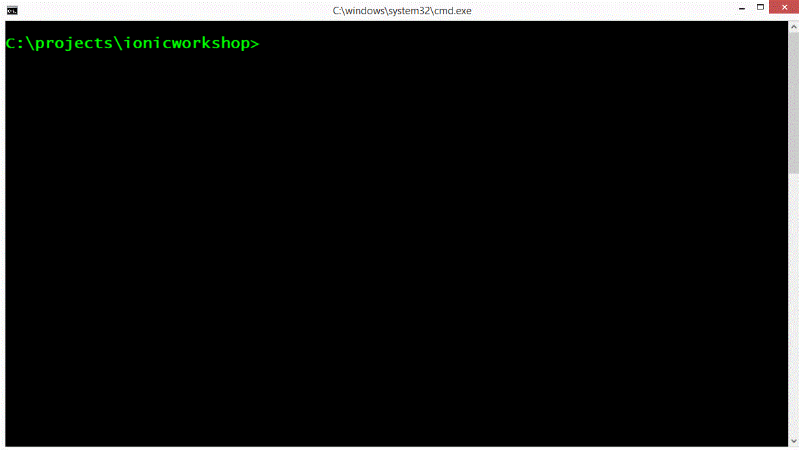

# Materials for the Ionic Workshop

This repository will contain all of the materials for the ionic workshop that I am running at [O'Reilly Fluent Conference](http://conferences.oreilly.com/fluent/javascript-html-us).

## Goal
----

The goal of this workshop is to introduce you to the Ionic Framework and what makes it so cool for developing cross platform mobile application.  You will walk away from the workshop with a completed todo application that stores its data in the cloud.  

## Who Should Attend
----

If you are a web developer that has a desire to create a mobile application that you can release through the Apple or Google app stores.


## Skills Needed
----

* Html - Beginner
* Javascript - Intermediate
* Css - Beginner
* Angular - Beginner 
* Using the Command Line - Intermediate
 
## Minimum Software to Install
----

* NodeJs -  [http://nodejs.org](http://nodejs.org)
* Visual Studo Code - [https://code.visualstudio.com/](https://code.visualstudio.com/)
* Git  -  [https://msysgit.github.io/](https://msysgit.github.io/)
    * Note: Mac already has it installed
* Globally install npm packages:
* Google Chrome - [https://www.google.com/chrome/browser/desktop/](https://www.google.com/chrome/browser/desktop/)


```
    npm install -g gulp bower cordova ionic
```

## Optional
----

* Ionic View application for Android or iOS [http://view.ionic.io/](http://view.ionic.io/)
* Ionic.io account (needed for Ionic View) - [http://ionic.io/](http://ionic.io/)


## Testing Software Installs
----

All of these should return back a version number.

```
  node -v
  npm -v
  ionic -v
  gulp -v
  cordova -v
  git --version
```  


## Creating Base Project
----

1. Open a command prompt or terminal
1. Navigate to where you normally store your project file 
   * I store mine at c:\projects
1. Run the following command to create the initial project

```
      ionic start todo blank
```

Here is an example of what your should see when you  run the command (animated gif).



After the project is succcessfully created, run bower and npm installs

```
npm install
bower install
```

## Testing Base Project
----

To test that the project is working correctly run

```
ionic serve
```

You should see the web site launch in your default browser and a header that says Ionic Blank Starter

Here is an example (animated gif)


## Clone this repository

Make sure to clone this repository or download the zip file for it before the talk.  

I will be posting code snippets and samples that we will be using through out the workshop.


## See You There
See you at the workshop.  If you have any questions before or after the workshop, you can find me one twitter at [http://twitter.com/digitaldrummerj](http://twitter.com/digitaldrummerj) or leave a comment at the Fluent Conference web site under the workshop.